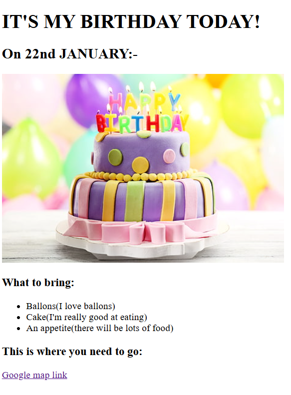

# 🎂 It's My Birthday – HTML Project

This is my first HTML project where I created a simple birthday invitation webpage.

## 🔧 Technologies Used
- HTML5

## 📌 Features
- Birthday invitation layout
- Image and list usage
- Google Maps link
- Beginner-friendly structure

## 🌐 Live Demo
👉 https://kaushikshivam-stack.github.io/my-birthday-html-project/

## 🙌 What I Learned
- Basic HTML structure
- Headings, lists, images, and links
- How to deploy a website using GitHub Pages

## 📸 Project Screenshot

⭐ This project marks the beginning of my web development journey!
